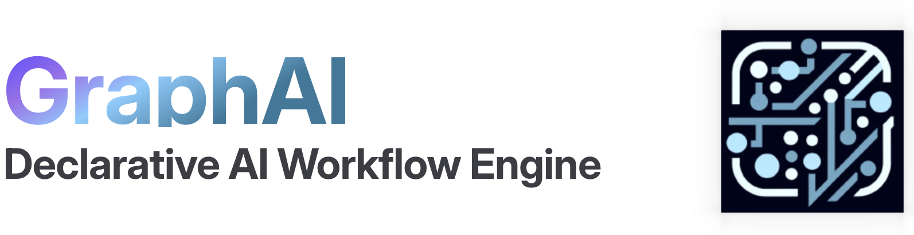

<picture>
  <source media="(prefers-color-scheme: light)" srcset="./docs/images/readme_logo_light.png">
  <source media="(prefers-color-scheme: dark)" srcset="./docs/images/readme_logo_dark.png">
  
</picture>

GraphAI is an asynchronous data flow execution engine, which allows developers to build *agentic applications* by describing *agent workflows* as declarative data flow graphs in YAML or JSON. 

## Documentation

[Official Website](https://graphai.info)

### SPECS
- [Scientific Paper](https://graphai.info/guide/Paper.html)
- [GraphAI core](./packages/graphai/README.md)

### TypeScript API Document
- [API Document](./APIDocument.md)
- [API Document by typedoc](https://receptron.github.io/graphai/apiDoc/)

### Agent Document

- [Agent Document](./docs/agentDocs/README.md)

### Tools
- [GraphAI cli](./packages/cli/README.md)

## Application Samples
- [Tutorial](https://graphai.info/guide/tutorial.html)
- [GraphAI samples for developer](./packages/samples/README.md)
- [GraphAI samples for end user](https://github.com/receptron/graphai_samples)

## Development
- [Collaboration](./Collaboration.md)

## npm links

### GraphAI
https://www.npmjs.com/package/graphai

### GraphAI Agents
https://www.npmjs.com/org/graphai

### GraphAI Utilities
https://www.npmjs.com/org/receptron

## Web demo & tool

### GraphAI web demo
https://github.com/receptron/graphai-demo-web

### Grapys - GraphAI GUI tool
https://github.com/receptron/grapys
