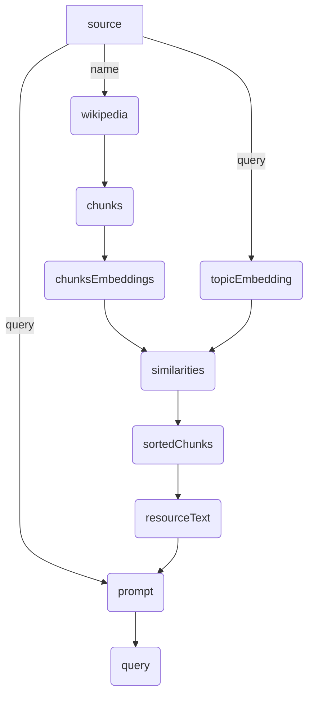
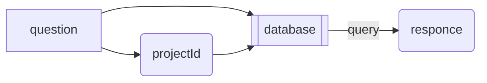
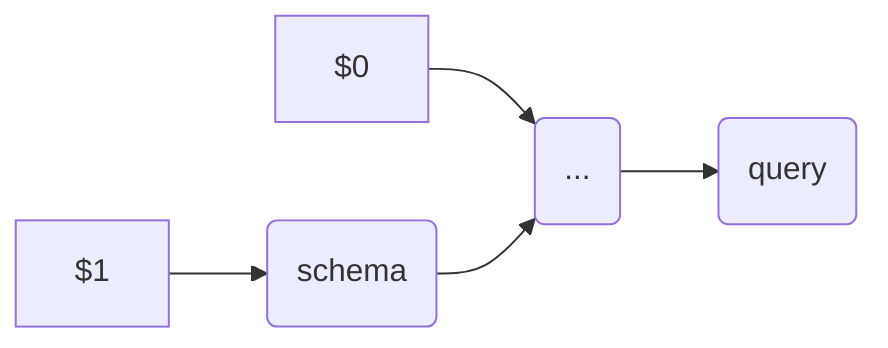
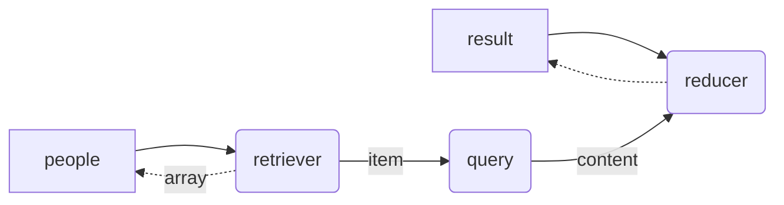
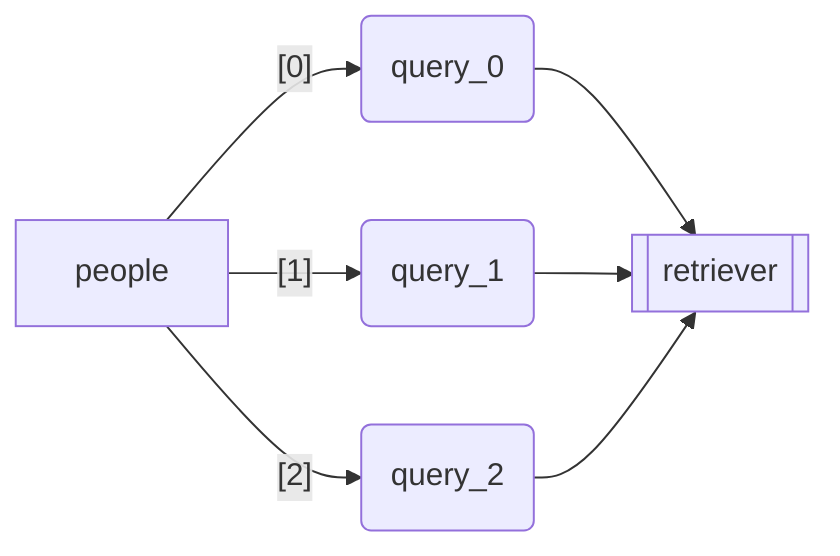

# GraphAI

## Overview

GraphAI is an asynchronous data flow execution engine, which allows developers to build *agentic applications* by describing *agent workflows* as declarative data flow graphs in YAML or JSON. 

As Andrew Ng has described in his article, "[The batch: Issue 242](https://www.deeplearning.ai/the-batch/issue-242/)", better results can often be achieved by making multiple calls to a Large Language Model (LLM) and allowing it to incrementally build towards a higher-quality output. Dr. Ng refers to this approach as 'agentic workflows.' 

Such *agentic applications* need to make multiple asynchronous API calls (such as OpenAI's chat-completion API, database query, web search, and etc.) and manage data dependencies among them, such as giving the answer from one LLM call to another -- which will become quite difficult to manage in a traditional programing style as the complexity of the application increases, because of the asynchronous nature of those APIs.

GraphAI allows developers to describe dependencies among those agents (asynchronous API calls) in a data flow graph in YAML or JSON, which is called *declarative data flow programming* . The GraphAI engine will take care of all the complexity of concurrent asynchronous calls, data dependency management, task priority management, map-reduce processing, error handling, retries and logging. 

## Declarative Data Flow Programming

Here is a simple example, which uses the Wikipedia as the data source and perform an in-memory RAG (Retrieval-Augmented Generation).

```YAML
nodes:
  source: // Input data to this RAG application
    value:
      name: Sam Bankman-Fried
      query: describe the final sentence by the court for Sam Bank-Fried
  wikipedia: // Retrieve data from Wikipedia
    agentId: wikipediaAgent
    inputs: [source.name]
  chunks: // Break the text from Wikipedia into chunks (2048 character each with 512 overlap）
    agentId: stringSplitterAgent
    inputs: [wikipedia]
  chunkEmbeddings: // Get embedding vector of each chunk
    agentId: stringEmbeddingsAgent
    inputs: [chunks]
  topicEmbedding: // Get embedding vector of the question
    agentId: stringEmbeddingsAgent
    inputs: [source.query]
  similarities: // Calculate the cosine similarity of each chunk
    agentId: dotProductAgent
    inputs: [chunkEmbeddings, topicEmbedding]
  sortedChunks: // Sort chunks based on their similarities
    agentId: sortByValuesAgent
    inputs: [chunks, similarities]
  referenceText: // Concatenate chunks up to the token limit (5000)
    agentId: tokenBoundStringsAgent
    inputs: [sortedChunks]
    params:
      limit: 5000
  prompt: // Generate a prompt with that reference text
    agentId: stringTemplateAgent
    inputs: [source, referenceText]
    params:
      template: |-
        Using the following document, ${0}
        ${1}
  query: // retrieves the answer from GPT3.5
    agentId: slashGPTAgent
    params:
      manifest:
        model: gpt-3.5-turbo
    isResult: true // indicating this is the final result
    inputs: [prompt]
```



Notice that the conversion of the querty text into an embedding vector and text chunks into an array of embedding vectors can be done concurrently because there is no dependency between them. GraphAI will automatically recognize it and execute them concurrently. This kind of *concurrent programing* is very difficult in traditional programming style, and GraphAI's *data flow programming* style is much better alternative.

## Quick Install

```
npm install graphai
```

or

```
yarn add graphai
```

## Data Flow Graph

A Data Flow Graph (DFG) is a JavaScript object, which defines the flow of data. It is typically described in YAML file and loaded at runtime.

A DFG consists of a collection of [nodes](#node), which contains a series of nested properties representing individual nodes in the data flow. Each node is identified by a unique key, *nodeId* (e.g., node1, node2) and can contain several predefined properties (such as params, inputs, and value) that dictate the node's behavior and its relationship with other nodes. There are two types of nodes, [computed nodes](#computed-node) and [static nodes](#static-node), which are described below.

Connections between nodes will be established by references from one not to another, using either its "inputs" or "update" property. The values of those properties are *data sources*. A *data souce* is specified by either the nodeId (e.g., "node1"), or nodeId + propertyId ("node1.item").

### DFG Structure

- 'nodes': A list of node. Required.
- 'concurrency': An optional property, which specifies the maximum number of concurrent operations (agent functions to be executed at the same time). The default is 8.
- 'loop': An optional property, which specifies if the graph needs to be executed multiple times. See the [Loop section below](#loop) for details.

## Agent

An *agent* is an abstract object which takes some inputs and generates an output asynchronously. It could be an LLM (such as GPT-4), a media generator, a database, or a REST API over HTTP. A node associated with an agent (specified by 'agentId' property) is called [computed node](#computed-node), which takes a set of inputs from other nodes, lets the agent to process it, and pushes the returned value to other nodes.

### Agent function

An agent function is a TypeScript function, which implements a particular *agent*. An *agent function* receives two set of parameters via AgentFunctionContext:

- params: agent specific parameters specified in the DFG (specified by the "params" property of the node)
- inputs: a set of inputs came from other nodes (specified by "inputs" property of the node).

## Node

There are two types of Node, *computed nodes* and *static nodes*. A *computed node* is associated with an *agent function*, which receives some inputs, performs some computations asynchronously then returns the result (output). A *static node* is a placeholder of a value (just like a variable in programming language), which is specified by the *value* property, injected by an external program, or is updated at the end of iteration (see the [loop](#loop)). 

### Computed Node

A *computed node* have following properties.

- 'agentId': An **required** property, which specifies the id of the *agent function*.
- 'params': An optional agent-specific property to control the behavior of the associated agent function. 
- 'inputs': An optional list of *data sources* that the current node receives the data from. This establishes a data flow where the current node can only be executed after the completion of the nodes listed under 'inputs'. If this list is empty, the associated *agent function* will be immediatley executed. 
- 'anyInput': An optiona boolean flag, which indicates that the associated *agent function* will be called when at least one of input data became available. Otherwise, it will wait until all the data became available.
- 'retry': An optional number, which specifies the maximum number of retries to be made. If the last attempt fails, the error will be recorded.
- 'timeout': An optional number, which specifies the maximum waittime in msec. If the associated agent function does not return the value in time, the "Timeout" error will be recorded. The returned value received after the time out will be discarded.
- 'isResult': An optional boolean value, which indicates that the return value of this node, should be included as a property of the return value from the run() method of the GraphUI instance.
- 'priority': An optional number, which specifies the priority of the execution of the associated agent (the task). Default is 0, which means "neutral". Negative numbers are allowed as well.

### Static Node

A *static* node have following properties.

- 'value': An **required** property, which specifies the initial value of this static node (equivalent to calling the injectValue method from outside).
- 'update': An optional property, which specifies the *data source* after each iteration. See the [loop](#loop) for details.

## Flow Control

Since the data-flow graph must be asyclic by design, we added a few mechanism to control data flows, [nesting](#nesting), [loop](#loop), [mapping](#mapping) and [condtional flow](#conditional-flow).

### Nested Graph

In order to make it easy to reuse some code, GraphAI supports nesting. It requires a special agent function, which creates an instance (or instances) of GraphAI object within the agent function and execute it. The system supports two types of nesting agent functions (nestAgent and mapAgent), but developers can create their own using the standard agent extension mechanism.

A typical nesting graph looks like this:

```YAML
nodes:
  question:
    value: "Find out which pmaterials we need to purchase this week for Joe Smith's residential house project."
  projectId: // identifies the projectId from the question
    agentId: "identifierAgent"
    inputs: ["source"] // == "sourceNode.query"
  database:
    agentId: "nestedAgent"
    inputs: ["question", "projectId"]
    graph:
      nodes:
        schema: // retrieves the database schema for the apecified projectId
          agentId: "schemaAgent"
          inputs: ["$1"]
        ... // issue query to the database and build an appropriate prompt with it.
        query: // send the generated prompt to the LLM
          agentId: "llama3Agent"
          inputs: ["prompt"]
          isResult: true
  response: // Deliver the answer
    agentid: "deliveryAgent"      
    inputs: [database.query.$last.content]
```

The databaseQuery node (which is associated "nestedAgent") takes the data from "question" node abd "projectId" node, and make them available to inner nodes (nodes of the child graph) via phantom node, "$0" and "$1". After the completion of the child graph, the data from "query" node (which has "isResult" property) becomes available as a property of the output of "database" node.

Here is the diagram of the parent graph.



Here is the diagram of the child graph. Notice that two phantom nodes are automatically created to allow inner nodes to access input data from the parent graph.



This mechanism does not only allows devleoper to reuse code, but also makes it possible to execute the child graph on another machine using a "remote" agent (which will be released later), enabling the *distributed execution* of nested graphs. 

### Loop

The loop is an optioal property of a graph, which has two optional properties. The *count* property specifies the number of times the graph needs to be executed and the *while* property specifies the condition required to contineu the loop in the form of node name (nodeId) or its property (nodeId.propId). Unlike JavaScript, an empty array will be treated as false.

Here is an example, which performs an LLM query for each person in the list and create the list of answers. The "people" node (static), is initialized with an array of names, and the "retriever" node (computed) retrieves one name at a time, and send it to the "query" node (computed) to perform an LLM query. The "reducer" append it the array retrieved form the "result" node (static node, which is initialized as an empty array). 

The "update" property of two static nodes ("people" and "result"), updates those properties based on the results from the previous itelation. This loop continues until the value of "people" node become an empty array.

```
loop:
  while: people
nodes:
  people:
    value: [Steve Jobs, Elon Musk, Nikola Tesla]
    update: retriever.array
  result:
    value: []
    update: reducer
    isResult: true
  retriever:
    agentId: shift
    inputs: [people]
  query:
    agentId: slashgpt
    params:
      manifest:
        prompt: Describe about the person in less than 100 words
    inputs: [retriever.item]
  reducer:
    agentId: push
    inputs: [result, query.content]
```



The *loop* mechanism is often used with a nested graph, which receives an array of data from a node of the parent graph and performs the "reduction" process of a *map-reduce* operation, just like the *reduce* method of JavaScript.

Please notice that each iteration will be done sequencially unlike the *mapping* described below.

### Mapping

The mapAgent is one of nested agents, which receives an array of data as an input (inputs[0]) and performs the same operation (specified by its graph property) on each item concurrently.

If the size of array is N, the mapAgent creates N instances of GraphAI object, and run them concurrently.

After the completion of all of instances, the mapAgent returns an array of results, just like the map function of JavaScript. 

The following graph will generate the same result (an array of answers) as the sample graph for the *loop*, but three queries will be issued concurretly. 

```
nodes:
  people:
    value: [Steve Jobs, Elon Musk, Nikola Tesla]
  retriever:
    agentId: "mapAgent"
    inputs: ["people"]
    graph:
      nodes:
        query:
          agentId: slashgpt
          params:
            manifest:
              prompt: Describe about the person in less than 100 words
          inputs: ["$0"]
```

Here is the conceptual representation of this operation.


### Conditional Flow

To be filled.

## Concurrency

It is possible to specify the maximum number of concurrent execution by setting the *concurrency* property of the graph at the top level. The default is 8.

Since the task queue is shared between the parent graph and the children graph (uness the graph is running remotely), tasks created by the child graph will be bound by the same concurrency specified by the parent graph. 

Since the task executing the nested graph will be in "running" state while tasks within the child graph are runnig, the concurrency limit will be incremented by one when we start running the child graph and restored when it is completed.

By default, all the tasks will have a priority "0", which means neutral. By default, all the tasks will be executed in first-in first-out basis. 

It is possible to change this priority by specifying Node's optional property "priority". The task with higher priority will be executed first. 

## GraphAI class

### ```constructor(data: GraphData, callbackDictonary: AgentFunctionDictonary)```
Initializes a new instance of the GraphAI object with the specified graph data and a dictionary of callback functions.

- ```data: GraphData```: The graph data including nodes and optional concurrency limit.
- ```callbackDictonary: AgentFunctionDictonary | AgentFunction<any, any, any>```: A dictionary mapping agent IDs to their respective callback functions, or a single default callback function to be used for all nodes.

### ```async run(): Promise<ResultDataDictonary<ResultData>>```
Executes the graph asynchronously, starting with nodes that have no dependencies or whose dependencies have been met. The method continues to execute nodes as their dependencies are satisfied until all nodes have been executed or an error occurs.

Returns: A promise that resolves with the results of all executed nodes or rejects with the first encountered error.

### ```results(): ResultDataDictonary<ResultData>```
Compiles and returns the results of all executed nodes in the graph.

Returns: A dictionary mapping node IDs to their results. Only includes nodes that have completed execution and produced a result.

### ```errors(): Record<string, Error>```
Compiles and returns the errors from all nodes that encountered an error during execution.

Returns: A dictionary mapping node IDs to the errors they encountered. Only includes nodes that have executed and encountered an error. It does not include any errors which have been retried.

### ```transactionLogs(): Array<TransactionLog>```
Retrieves all transaction logs recorded during the execution of the graph.

Returns: An array of transaction logs detailing the execution states and outcomes of the nodes within the graph.

### ```injectValue(nodeId: string, result: ResultData): void```
Injects a result into a specified node. This is used to manually set the result of a static node, allowing dependent nodes to proceed with execution.

- ```nodeId: string```: The ID of the static node into which the result is to be injected.
- ```result: ResultData```: The result to be injected into the specified node.

## Collaboration

Step 1. Install git, node and yarn

Step 2. Clone the project and install necessary node modules

```
git clone git@github.com:snakajima/graphai.git
cd graphai
yarn install
```

Step 3. Set the environment variable OPENAI_API_KEY to your own key (=sk-...)

You need to set ANTHROPIC_API_KEY as well, if you want to use Claude.

Step 4. Run the test script

Run the test

```
npm run test
```

Step 5. Run one of sample scripts

```
npm run sample ./samples/home.ts
```

Step 6. Write some code and send pull requests

Key principles:

1. Keep the core (Node and GraphAI classes) small and simple.
2. Enhance the platform by adding 'agents' (plug ins).
3. Simple but effective test scripts make it easy to maintain.
4. Run "npm run format" before submitting pull requests. 
