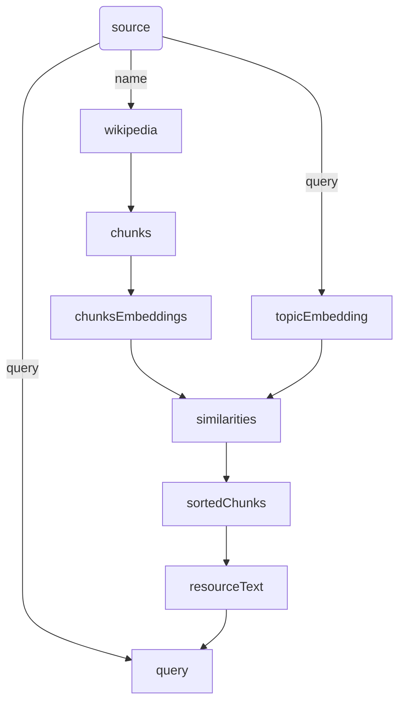

# GraphAI

## Overview

GraphAI is an asynchronous data flow execution engine, which allows developers to build *agentic applications* by describing *agent workflows* as declarative data flow graphs in YAML or JSON. 

As Andrew Ng has described in his article, "[The batch: Issue 242](https://www.deeplearning.ai/the-batch/issue-242/)", better results can often be achieved by making multiple calls to a Large Language Model (LLM) and allowing it to incrementally build towards a higher-quality output. Dr. Ng refers to this approach as 'agentic workflows.' 

Such *agentic applications* need to make multiple asynchronous API calls (such as OpenAI's chat-completion API, database query, web search, and etc.) and manage data dependencies among them, such as giving the answer from one LLM call to another -- which will become quite difficult to manage in a traditional programing style as the complexity of the application increases, because of the asynchronous nature of those APIs.

GraphAI allows developers to describe dependencies among those agents (asynchronous API calls) in a data flow graph in YAML or JSON, which is called *declarative data flow programming* . The GraphAI engine will take care of all the complexity of concurrent asynchronous calls, data dependency management, error handling, retries and logging. 

## Example

Here is an simple example, which uses the Wikipedia as the data source and perform an in-memory RAG.

```YAML
nodes:
  source: // Input data to this RAG application
    value:
      name: Sam Bankman-Fried
      query: describe the final sentence by the court for Sam Bank-Fried
  wikipedia: // Retrieve data from Wikipedia。
    agentId: wikipediaAgent
    inputs: [source.name]
  chunks: // Break the text from Wikipedia into chunks(2048 character each with 512 overlap）
    agentId: stringSplitterAgent
    inputs: [wikipedia]
  chunkEmbeddings: // Get embedding vector of each chunk
    agentId: stringEmbeddingsAgent
    inputs: [chunks]
  topicEmbedding: // Get embedding vector of the question
    agentId: stringEmbeddingsAgent
    inputs: [source.query]
  similarities: // Calculate the cosine similarity of each chunk
    agentId: dotProductAgent
    inputs: [chunkEmbeddings, topicEmbedding]
  sortedChunks: // Sort chunks based on the similarity
    agentId: sortByValuesAgent
    inputs: [chunks, similarities]
  referenceText: // Concatenate chunks up to the token limit (5000)
    agentId: tokenBoundStringsAgent
    inputs: [sortedChunks]
    params:
      limit: 5000
  prompt: // Generate a prompt with that reference text
    agentId: stringTemplateAgent
    inputs: [source, referenceText]
    params:
      template: |-
        Using the following document, ${0}
        ${1}
  query: // retrieves the answer from GPT3.5
    agentId: slashGPTAgent
    params:
      manifest:
        model: gpt-3.5-turbo
    isResult: true // indicating this is the final result
    inputs: [prompt]
```



Notice that the conversion of the querty text into an embedding vector and text chunks into an array of embedding vectors can be done concurrently because there is no dependencies among them. GraphAI will automatically recognize it and execute them concurrently. This kind of *concurrent programing* is very difficult in traditional programming style, and GraphAI's *data flow programming* style is much better alternative.

## Quick Install

```
npm install graphai
```

or

```
yarn add graphai
```

## Collaboration

Step 1. Install git, node and yarn

Step 2. Clone the project and install necessary node modules

```
git clone git@github.com:snakajima/graphai.git
cd graphai
yarn install
```

Step 3. Set the environment variable OPENAI_API_KEY to your own key (=sk-...)

You need to set ANTHROPIC_API_KEY as well, if you want to use Claude.

Step 4. Run the test script

Start web server for http agent

```
cd tests/http-server/docs/
npx http-server
```

then run the test

```
npm run test
```

Step 5. Run one of sample scripts

```
npm run sample ./samples/home.ts
```

Step 6. Write some code and send pull requests

Key principles:

1. Keep the core (Node and GraphAI classes) small and simple.
2. Enhance the platform by adding 'agents' (plug ins).
3. Simple but effective test scripts make it easy to maintain.
4. Run "npm run format" before submitting pull requests. 

## Data Flow Graph

A Data Flow Graph (DFG) is a JavaScript object, which defines the flow of data. It is typically described in YAML file and loaded at runtime.

A DFG consists of a collection of 'nodes', which contains a series of nested properties representing individual nodes in the data flow. Each node is identified by a unique key, *nodeId* (e.g., node1, node2) and can contain several predefined properties (params, inputs, anyInput, retry, timeout, agentId, fork, value, update) that dictate the node's behavior and its relationship with other nodes.

Connections between nodes will be established by references from one not to another, using either its "inputs" or "update" property. The values of those properties are *data sources*. A *data souce* is specified by either the nodeId (e.g., "node1"), or nodeId + propertyId ("node1.item").

### DFG Structure

- 'nodes': A list of node. Required.
- 'concurrency': An optional property, which specifies the maximum number of concurrent operations (agent functions to be executed at the same time). The default is 8.
- 'loop': An optional property, which specifies if the graph needs to be executed multiple times. The loop is an JavaScript object, which has two optional properties. The *count* property specifies the number of times the graph needs to be executed and the *while* property specifies the condition required to contineu the loop in the form of node name (nodeId) or its property (nodeId.propId). Unlike JavaScript, an empty array will be treated as false.

```
loop:
  while: people
nodes:
  people:
    value:
      - Steve Jobs
      - Elon Musk
      - Nikola Tesla
    update: retriever.array
  result:
    value: []
    update: reducer
  retriever:
    agentId: shift
    inputs: [people]
  query:
    agentId: slashgpt
    params:
      manifest:
        prompt: 指定した人について日本語で４００字以内で答えて
    inputs: [retriever.item]
  reducer:
    agentId: push
    inputs: [result, query.content]
```

## Agent

An agent is an abstract object, which takes some inputs and generates an output asynchronously. It could be an LLM (such as GPT-4), an image/video/music generator, a database, or a REST API over HTTP. Each node (except 'source node') is associated with an agent function, which takes data flow into the node as inputs, and generates an output.

## Agent function

An agent function is a TypeScript function, which implements an agent. A DFG is associated one or more agent functions. If the DFG is associated with multiple agent functions, each node needs to be associated only one of them (either explicitly with 'agentId' or implicitly to the default Agent function).

An agent function receives two set of parameters via AgentFunctionContext, agent specific parameters specified in the DFG and input data came from other nodes.

## Node Structure

There are two types of Node, *computed nodes* and *static nodes*. A *computed node* is associated with an *agent function*, which receives some inputs, performs some computations asynchronously then returns the result (output). A *static node* is a placeholder of a value (just like a variable in programming language), which is injected by an external program, or is retrived from a *data source* (in case of interations). 

A *computed node* have following properties.

- 'agentId': An **required** property, which specifies the id of the *agent function*.
- 'inputs': An optional list of *data sources* that the current node depends on. This establishes a flow where the current node can only be executed after the completion of the nodes listed under 'inputs'. If this list is empty, the associated *agent function* will be immediatley executed. 
- 'anyInput': An optiona boolean flag, which indicates that the associated *agent function* will be called when at least one of input data became available. Otherwise, it will wait until all the data became available.
- 'retry': An optional number, which specifies the maximum number of retries to be made. If the last attempt fails, that return value will be recorded.
- 'timeout': An optional number, which specifies the maximum waittime in msec. If the associated agent function does not return the value in time, the "Timeout" error will be recorded and the returned value will be discarded. 
- 'params': An optional property to the associated agent function, which are agent specific.
- 'fork': An optional paramter, which specifies the number of concurrent transactions to be created for the current node.

A *static* node have following properties.

- 'value': An **required** property, which specifies the initial value of this static node (equivalent to calling the injectValue method from outside).
- 'update': An optional property, which specifies the *data source* after each iteration.

## GraphAI class

### ```constructor(data: GraphData, callbackDictonary: AgentFunctionDictonary)```
Initializes a new instance of the GraphAI class with the specified graph data and a dictionary of callback functions.

- ```data: GraphData```: The graph data including nodes and optional concurrency limit.
- ```callbackDictonary: AgentFunctionDictonary | AgentFunction<any, any, any>```: A dictionary mapping agent IDs to their respective callback functions, or a single default callback function to be used for all nodes.

### ```async run(): Promise<ResultDataDictonary<ResultData>>```
Executes the graph asynchronously, starting with nodes that have no dependencies or whose dependencies have been met. The method continues to execute nodes as their dependencies are satisfied until all nodes have been executed or an error occurs.

Returns: A promise that resolves with the results of all executed nodes or rejects with the first encountered error.

### ```results(): ResultDataDictonary<ResultData>```
Compiles and returns the results of all executed nodes in the graph.

Returns: A dictionary mapping node IDs to their results. Only includes nodes that have completed execution and produced a result.

### ```errors(): Record<string, Error>```
Compiles and returns the errors from all nodes that encountered an error during execution.

Returns: A dictionary mapping node IDs to the errors they encountered. Only includes nodes that have executed and encountered an error. It does not include any errors which have been retried.

### ```transactionLogs(): Array<TransactionLog>```
Retrieves all transaction logs recorded during the execution of the graph.

Returns: An array of transaction logs detailing the execution states and outcomes of the nodes within the graph.

### ```injectValue(nodeId: string, result: ResultData): void```
Injects a result into a specified node. This is used to manually set the result of a static node, allowing dependent nodes to proceed with execution.

- ```nodeId: string```: The ID of the static node into which the result is to be injected.
- ```result: ResultData```: The result to be injected into the specified node.
