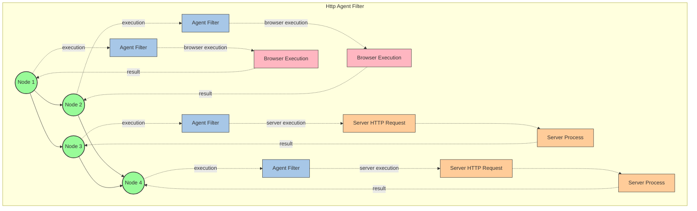

# @graphai/http_client_agent_filter for GraphAI

Http Client Agent filter for GraphAI.

## Install

```
yarn add @graphai/http_client_agent_filter
```

### USAGE

In graph flow, bypass the agent execution and run it on the server via http.

Refer to the web sample.

https://github.com/isamu/graphai-stream-web/blob/main/src/views/Home.vue




