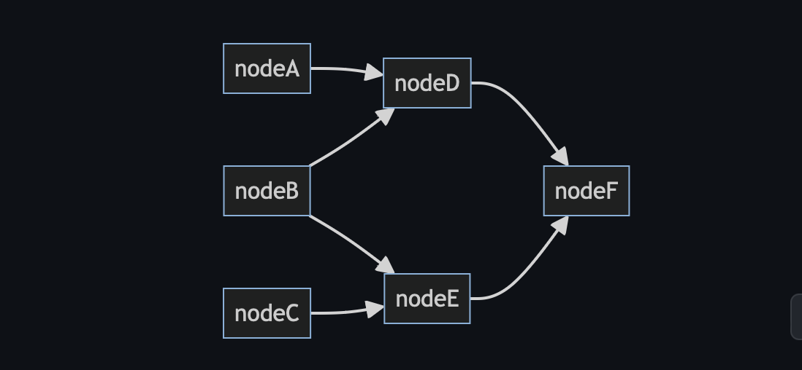

# Async/Aways is Not All You Need

The async/await pattern became a feature of many programming languages, such as C#, C++, Dart, Kotlin, Rust, Python, TypeScript/JavaScript and Swift. It allows an asynchronous, non-blocking function to be structured in a way similar to an ordinary synchronous function.

While it is quite convenient, it is not suitable to perform multiple asynchronous tasks concurrently. 

For example, following TypeScript code will execute TaskA and TaskB sequentially even though they are independent.

```typescript
const TaskRunnder = async () => {
  const a = await TaskA();
  const b = await TaskB();
  const c = await TaskC(a, b);
}
```

To perform TaskA and TaskB concurrently, you need to use Promise.all.

```typescript
const TaskRunner = async () => {
  const [a, b] = await Promise.all(TaskA(), TaskB());
  const c = await TaskC(a, b);
}
```

This technique is fine for simple cases, but will become harder for complex case like this (if you are an experienced TypeScript developer, try to fully optimize it before reading further):

```typescript
const TaskRunner = async () => {
  const a = await TaskA();
  const b = await TaskB();
  const c = await TaskC();
  const d = await TaskD(a, b);
  const e = await TaskE(b, c);
  return TaskF(d, e);
};
```

I tested this quiz with devleopers on X and a few other developer forums, and many developers, even experienced developers came up with this answer:

```typescript
const TaskRunner = async () => {
  const [a, b, c] = await Promise.all([TaskA(), TaskB(), TaskC()]);
  const [d, e] = await Promise.all([TaskD(a, b), TaskE(b, c)]);
  return TaskF(d, e);
};
```

While it performs much better than the original code, this is not optimal. TaskD needs to wait for TaskC even though it does not have to, and TaskE needs to wait for TaskE even though it does not have to.

When I pointed out this issue, one developer came up with the following answer, noticing the fact that both TaskD and TaskE need to wait for TaskB to be completed.

```typescript
const TaskRunner = async () => {
  const promiseA = TaskA();
  const promiseC = TaskC();
  const b = await TaskB();
  const AthenD = async () => {
    const a = await promiseA;
    return TaskD(a, b);
  }
  const CthenE = async () => {
    const c = await promiseC;
    return TaskE(b, c);
  }
  const [d, e] = await Promise.all([AthenD(), CthenE()]);
  return TaskF(d, e);
}
```

While it is fully optimized, this style of code is very hard to read, and it does not scale. 

To solve this problem, I propose "data-flow programming style", treating tasks as nodes of acyclic data-flow graph and paying attention to dependencies among them.



With data-flow programming style, the code will look like this:

```typescript
import { computed } from '@receptron/graphai_lite';

const ExecuteAtoF = async () => {
  const nodeA = computed([], TaskA());
  const nodeB = computed([], TaskB());
  const nodeC = computed([], TaskC());
  const nodeD = computed([nodeA, nodeB], TaskD);
  const nodeE = computed([nodeB, nodeC], TaskE);
  const nodeF = computed([nodeD, nodeE], TaskF);
  return nodeF;
};
```

```cost nodeD = computed([nodeA, nodeB], TaskD);``` indicates ```nodeD``` is the node representing ```taskD``` and it requires data from ```nodeA``` and ```nodeB```. 

```computed()``` is a function in node package, @receptron/graphai_lite, which creates a "computed node" from an array of input nodes and an asynchronous function.
