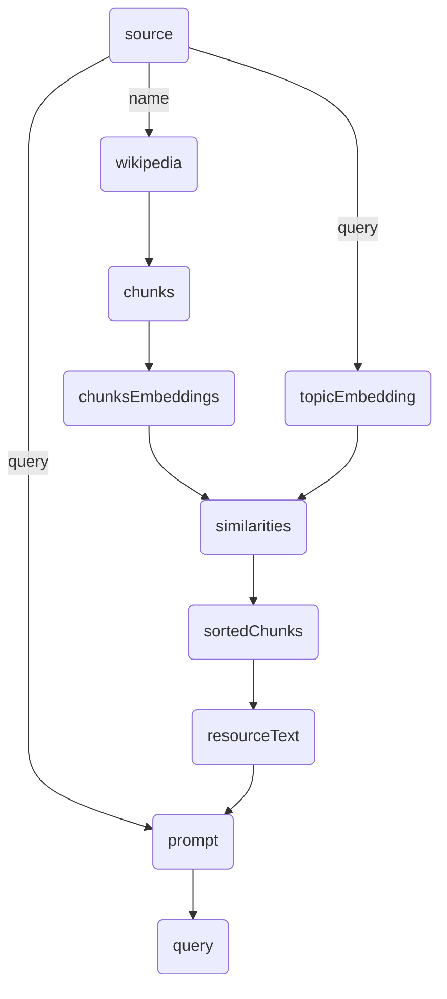

# Leveraging Data Flow Programming for Scalable and Efficient AI Systems in Distributed Environments

<p style="text-align: center;">
Satoshi Nakajima
</p>

Artificial Intelligence (AI) applications increasingly require robust frameworks capable of handling complex, asynchronous operations across distributed computing environments. Data flow programming offers a promising paradigm to address these challenges by enabling inherently concurrent and modular program structures. This paper explores the application of data flow programming principles to build scalable and efficient AI systems that operate over distributed networks. We first introduce the foundational concepts of data flow programming and discuss its advantages for managing asynchronous calls and data dependencies transparently. Subsequently, we present a detailed methodology for implementing AI operations as independent, distributable nodes within a data flow graph, ensuring that each node can execute as soon as its input data are ready and regardless of the execution state of other nodes. We further delve into how data flow programming facilitates real-time data processing and simplifies the deployment of AI models on distributed architectures by enabling automatic load balancing and fault tolerance. Practical case studies are examined to demonstrate the effectiveness of this approach in real-world scenarios, ranging from large-scale machine learning tasks to real-time analytics. The paper concludes with a discussion of potential challenges and future research directions in optimizing data flow-based AI systems for increased performance and flexibility. Through this study, we aim to provide a comprehensive framework that not only enhances the execution efficiency of AI applications but also contributes to their scalability and maintainability in distributed computing landscapes.

## Introduction

The landscape of large language models (LLMs) is undergoing a transformative change, significantly influenced by the advent of open-source platforms such as Llama3. These models have become more accessible, faster, and cheaper, heralding a new era in which both small and large-scale models are utilized across a variety of devices and applications. Smaller LLMs are increasingly capable of running directly on local devices such as PCs and smartphones, bringing powerful AI tools to the fingertips of users without the need for constant server-side interaction. Conversely, the more robust and computationally demanding LLMs continue to operate on servers, handling more complex queries and tasks. This dichotomy necessitates a strategic approach to utilize the strengths of each model type effectively.

As the use of LLMs becomes more widespread, a novel approach known as the "agentic workflow" has gained popularity. This methodology leverages multiple calls to LLMs to refine results and enhance decision-making processes. Typically, these LLMs are accessed via asynchronous API calls or REST APIs, which are straightforward to implement for simpler applications. However, as applications grow in complexity and sophistication, the management of these API calls becomes a significant challenge.

The simplicity of asynchronous programming can often be deceptive, leading many developers, even those with considerable experience, to underestimate its complexity. Traditional programming methods such as multithreading, promises, and async/await patterns provide initial solutions but often fall short in scalability and efficiency when faced with complex, high-volume, and dynamic AI-driven applications. These traditional paradigms, while effective for basic tasks, struggle to keep up with the demands of advanced, real-time interactions and distributed computing environments necessary for modern AI applications.

In this paper, we explore the potential of data flow programming as a superior alternative for developing AI applications that utilize LLMs in distributed systems. By adopting a data flow approach, developers can better manage the inherent complexities of asynchronous operations, enabling more scalable, responsive, and robust AI applications. This introduction sets the stage for a detailed discussion on how data flow programming principles can revolutionize AI application development, particularly in environments where concurrency and real-time processing are paramount.

## Background and Related Work

The evolution of programming models and communication protocols has been pivotal in shaping the development and deployment of distributed systems, particularly in the realm of AI and large-scale data processing. This section reviews the historical progression from traditional remote procedure calls (RPC) to modern asynchronous programming paradigms, highlighting the challenges and innovations that have defined this journey.

### From Thread-Blocking RPC to RESTful Services

Initially, distributed computing relied heavily on thread-blocking RPC mechanisms and the Simple Object Access Protocol (SOAP), which were designed to allow programs to call functions or procedures on other servers. RPC and SOAP provided a means for developers to construct distributed software systems, where calls to remote servers would block the execution thread until the operation completed. While effective, these methods were tightly coupled and often led to inefficient use of resources due to their synchronous and blocking nature.

As web technologies evolved, Representational State Transfer (REST) over HTTP emerged as a more flexible and lightweight alternative, replacing complex SOAP-based services. RESTful APIs used standard HTTP methods and focused on stateless operations, making it easier to build scalable and maintainable services. Unlike RPC and SOAP, REST introduced a stateless request-response model, which was inherently better suited for the open, stateless nature of the web.

### Challenges with Promises and Callbacks

As asynchronous programming became more prevalent, particularly in web development, developers adopted promises and callbacks to handle operations without blocking main execution threads. However, managing complex sequences of asynchronous operations with callbacks led to "callback hell," where code became nested, less readable, and harder to maintain. Promises provided a more structured approach to handling asynchronous results, yet they too could become cumbersome in complex scenarios involving multiple asynchronous operations.

### Introduction of Async/Await

To simplify the development of asynchronous code, the async/await pattern was introduced, building on the foundation laid by promises. This syntactic sugar allowed developers to write code that looks synchronous but operates asynchronously. Although async/await greatly improved code readability and error handling, it was not without limitations. Specifically, while suitable for sequential asynchronous operations, it did not inherently provide optimizations for concurrent execution of multiple asynchronous tasks, which is often required in high-performance computing environments.

### Scalable Distributed Computing with MapReduce

Addressing the need for scalable and efficient processing of large data sets across clusters of machines, Google introduced MapReduce. This programming model simplified the processing of massive data sets over a distributed network by abstracting the complexity involved in parallelization, fault-tolerance, and data distribution. MapReduce became a cornerstone for various big data solutions, inspiring numerous distributed processing frameworks and systems designed to handle large-scale data under the principles of parallel processing and functional programming.

## Data Flow Programming Principles

Data flow programming represents a paradigm shift from traditional imperative programming models to a more modular and naturally parallel approach. At the core of data flow programming is the principle that program execution is driven by data availability rather than explicit control flow sequences. This section delves into the foundational principles of data flow programming, emphasizing its declarative nature and the use of modern data structuring languages such as YAML and JSON to facilitate distributed computing.

### Declarative Programming in Data Flow

Unlike imperative programming, which requires detailed instructions on how computations should be performed, declarative programming focuses on what the computation should accomplish. This distinction is critical in data flow programming, where operations are expressed as a series of interconnected nodes, each representing a unit of computation that processes input data and produces output. This network of nodes creates a graph where data flows between nodes asynchronously as soon as it becomes available.

In practical terms, data flow programming can be implemented using declarative specifications in YAML or JSON. These formats are widely used for their human-readable and machine-parsable structure, making them ideal for defining the nodes and data connections within a data flow program. For example, a YAML file might describe a series of processing steps and their dependencies, encapsulating both the operations to be performed and the data flow between these operations without dictating the exact sequence of execution.

### Distributed Execution via YAML/JSON

The use of YAML or JSON in data flow programming extends beyond mere specification; it facilitates the distribution of execution across multiple machines. By defining the data flow declaratively in these formats, the description of the workflow can be easily transmitted between different computing environments, from local devices to cloud servers. Each participating device or server can parse the YAML or JSON configuration, instantiate the required computational nodes, and begin processing as soon as the relevant data inputs are available. This capability aligns closely with the vision of distributed computing articulated by the founders of General Magic in the 1990s, who foresaw a world where devices and servers would seamlessly cooperate to achieve complex computational tasks.

### Realizing Distributed Computing

The adoption of YAML and JSON for describing data flow programs has profound implications for distributed computing. It not only standardizes the communication between disparate systems but also ensures that these systems can work together without the need for ongoing manual coordination. The asynchronous nature of data flow programming means that each component in the system can operate independently and only interact when necessary, thereby optimizing resource use and reducing bottlenecks typically associated with synchronous operations.

Moreover, this approach allows for scaling up or down based on the computational load by simply adding more nodes to the network or redistributing tasks among existing nodes. Each node, defined and configured through YAML or JSON, can be executed on the most appropriate machine, balancing the load and enhancing the overall efficiency of the system.

## Reference Implementation of Data Flow Programming Framework: GraphAI

Since it became clear to us that we need to adapt this data flow programming for agentic applications, we have chosen to create a reference implementation in TypeScript. We chose TypeScript over Python, because it runs both on the server side and the client side, especially inside any web browers.

The framework is called GraphAI and it serves as a practical embodiment of the principles discussed previously, specifically tailored for building scalable and efficient AI systems in distributed environments. GraphAI leverages the inherent modularity and concurrency of data flow programming to simplify the development and deployment of complex AI-driven applications.

Here is a graph that describes the necessary operaitions for in-memory RAG (Retrieval-Augmented Generation).

```YAML
nodes:
  source: # (1)
    value:
      name: Sam Bankman-Fried
      query: describe the final sentence by the court for Sam Bank-Fried
  wikipedia: # (2)
    agentId: wikipediaAgent
    inputs: [:source.name]
  chunks: # (3) 
    agentId: stringSplitterAgent
    inputs: [:wikipedia]
  chunkEmbeddings: # (4)
    agentId: stringEmbeddingsAgent
    inputs: [:chunks]
  topicEmbedding: # (5) 
    agentId: stringEmbeddingsAgent
    inputs: [:source.query]
  similarities: # (6)
    agentId: dotProductAgent
    inputs: [:chunkEmbeddings, :topicEmbedding.$0]
  sortedChunks: # (7) 
    agentId: sortByValuesAgent
    inputs: [:chunks, :similarities]
  referenceText: # (8) 
    agentId: tokenBoundStringsAgent
    inputs: [:sortedChunks]
    params:
      limit: 5000
  prompt: # (9) 
    agentId: stringTemplateAgent
    inputs: [:source.query, :referenceText]
    params:
      template: |-
        Using the following document, ${0}
        ${1}
  query: # (10)
    agentId: slashGPTAgent
    params:
      manifest:
        model: gpt-3.5-turbo
    isResult: true # indicating this is the final result
    inputs: [:prompt]
```

This application consists of 10 nodes. Each node responsible in either holding a data (*static data*) or performing some computations (*computed data*). A *computation node* is associated with a piece of code (*agent function*), which is specified by its *agentId* property. The *inputs* property of a *computation node* specifies the data sources for this node. 

1. "source" node: This is the input data to this RAG application. In the real application, this data will come from the outside of the application, such as the user.
2. "wikipedia" node: This node retrieves data from Wikipedia. The data source is the "name" property of the "source" property ("Sam Bankman-Fried"). The agent function associated with this node, "wikipadiaAgent" passes the value from this data source to Wikipedia API and retrieves the content of the article of that topic.
3. "chunks" node: This node receives the text data from the "wikipedia" node, and breaks it into overlapping text chunks, using the agent function, "stringSplitterAgent". The default size is 2048 character each and 512 character overlap, but can be altered by setting the params property.
4. "chunkEmbeddings" node: This node converts text chunks from the "chunks" node into embedding vectors. The associated "stringEmbeddingsAgent" calls OpenAI's "embeddings" API to perform this operation.
5. "topicEmbedding" node: This node converts the "query" property of the "source" node ("describe the final sentence by the court for Sam Bank-Frie") into an embedding vectors, also using "stringEmbeddingsAgent".
6. "similarities" node: This node calculate the cosine similarities of each embedding vector of chunks and the embedding vector of the query, performing the dot product of each. 
 Calculate the cosine similarity of each chunk
7. "sortedChunks" node: This node sorts chunks using the similarities as the sort key, putting more similar chunks to the top. 
8. "referenceText" node: This node generate a reference text by concatenate sorted chunks up to the token limit (5000, which is specified in the "params" property).
9. "prompt" node: This node generates a prompt using the specified template, using the data from "source" node and "referenceText" node.
10. "query" node: This node sends the output from "prompt" node to OpenAI's "chatCompletion" API using "slashGPTAgent".



### Architecture of GraphAI

GraphAI is structured around the concept of nodes and agents. Nodes represent individual computational tasks, while agents handle the asynchronous operations required by these tasks. Each node is defined in a YAML or JSON file, specifying its dependencies and the data flow between them. This structure enables GraphAI to execute tasks in a distributed manner across multiple computing environments.

### Node Types

There are two primary types of nodes within GraphAI:

**Computed Nodes**: These nodes perform operations using data provided by other nodes. They are associated with an agent that processes the data asynchronously. Computed nodes are crucial for operations that require external data fetching, complex computations, or interactions with AI models.

**Static Nodes**: Static nodes store data that can be used by other nodes. They act like variables in traditional programming, holding data that can be referenced throughout the execution of the graph.

### Agents

Agents in GraphAI are responsible for executing the operations defined in computed nodes. Each agent is a TypeScript function that performs specific tasks such as data retrieval, data processing, or API interaction. Agents are designed to operate independently, ensuring that the failure of one does not affect the others.

### Execution Flow

GraphAI processes tasks based on the availability of data, adhering to the principles of data flow programming. The execution of nodes is triggered by the readiness of their input data rather than a pre-defined execution order. This model is particularly effective in distributed systems where tasks may be executed on different servers or devices, as it reduces idle time and enhances the responsiveness of the system.

#### Nested Agents

Nested agents in GraphAI allow for complex workflows to be broken down into manageable sub-graphs, which can be executed independently or concurrently. This modular approach simplifies the development process by enabling developers to encapsulate and reuse logical components.

- **Definition**: A nested agent creates a new instance of a GraphAI object within an agent function, executing a sub-graph defined by the graph property.

- **Example**: Consider a scenario where you need to perform a sequence of operations that can be logically grouped together. A nested agent can handle these operations within its own graph, isolated from the parent graph but integrated into the overall workflow.

```YAML
nodes:
  parentNode:
    agent: "nestedAgent"
    inputs: [":inputData"]
    graph:
      nodes:
        subTask1:
          agent: "subTaskAgent1"
          inputs: [":$0"]
        subTask2:
          agent: "subTaskAgent2"
          inputs: [":subTask1"]
        result:
          agent: "subTaskResultAgent"
          inputs: [":subTask2"]
          isResult: true
```

In this example, parentNode is a nested agent that processes inputData through a sub-graph consisting of subTask1, subTask2, and result. Each sub-task operates independently within the nested graph, enabling modular and reusable workflows.

#### Map Reduce

The MapReduce paradigm is a powerful feature in GraphAI that facilitates concurrent processing of large datasets. It involves two primary phases: mapping and reducing.

- **Mapping**: In the mapping phase, a map agent takes an array of data as input and applies the same operation to each item concurrently.

- **Reducing**: In the reducing phase, the results from the map phase are aggregated to produce a single output.

This approach is particularly useful for parallelizing tasks across multiple nodes, enhancing scalability and efficiency.

```YAML
nodes:
  dataList:
    value: [data1, data2, data3]
  mapper:
    agent: "mapAgent"
    inputs: [":dataList"]
    graph:
      nodes:
        mapTask:
          agent: "processDataAgent"
          inputs: [":$0"]
          isResult: true
```

In this example, dataList contains an array of data items. The mapAgent processes each data item concurrently through the mapTask, utilizing the processDataAgent. The results are collected and can be further processed or reduced.

#### Conditional Flow with If/Unless

Conditional flow in GraphAI is managed using the if and unless properties. These properties enable the execution of nodes based on specific conditions, providing a flexible mechanism for controlling data flow.

- **If Property**: The if property allows a node to be executed only if a specified condition is met. The condition is defined by a data source, and the node is activated when the data source value is truthy.

- **Unless Property**: The unless property works oppositely, activating the node only if the specified data source value is falsy.

These properties are particularly useful for managing branching logic within the data flow graph.

```YAML
nodes:
  decisionNode:
    value: true
  conditionalTask:
    agent: "conditionalAgent"
    inputs: [":someData"]
    if: ":decisionNode"
```

n this example, conditionalTask will only be executed if decisionNode holds a truthy value. If decisionNode is false, the node will be skipped, allowing for dynamic and flexible workflow execution.

By incorporating nested agents, MapReduce, and conditional flow mechanisms, GraphAI provides a robust and versatile framework for developing scalable and efficient AI applications. These features enable developers to manage complex workflows, optimize performance, and ensure reliable execution in distributed environments.

### Concurrent and Asynchronous Execution

GraphAI is designed to take full advantage of concurrent and asynchronous execution, which are essential for leveraging modern multi-core and distributed computing environments. By utilizing the principles of data flow programming, GraphAI ensures that tasks are executed based on the availability of their input data rather than a predefined sequence. This approach allows for more efficient use of computational resources and better performance in distributed systems.

#### Sample Code: Concurrent Execution

To illustrate the power of data flow programming in GraphAI, consider the following example. This example demonstrates how GraphAI handles concurrent data retrieval and processing tasks using a simple data flow graph defined in YAML.

```YAML
nodes:
  users: 
    value: ["Alice", "Bob", "Charlie"]
  userProfiles: 
    agent: "mapAgent"
    inputs: [":users"]
    graph:
      nodes:
        profile: 
          agent: fetchUserProfile
          inputs: [":$0"]
        posts: 
          agent: fetchUserPosts
          inputs: [":$0"]
        combinedData: 
          agent: combineData
          inputs: [":profile", ":posts"]
          isResult: true
```

This graph performs the following operations:

1. users: A static node holding an array of user names.
2. userProfiles: A computed node that uses the mapAgent to process each user concurrently. It creates a nested graph for each user, consisting of three nodes:

- profile: Fetches the user's profile data.
- posts: Fetches the user's posts.
- combinedData: Combines the profile data and posts into a single output.

The nested graph for each user runs concurrently, allowing multiple user profiles to be processed simultaneously. Here’s how each agent function might be implemented in TypeScript:

```TypeScript
// Agent function to fetch user profile
async function fetchUserProfile(username: string): Promise<any> {
  const response = await fetch(`https://api.example.com/user/${username}/profile`);
  return response.json();
}

// Agent function to fetch user posts
async function fetchUserPosts(username: string): Promise<any> {
  const response = await fetch(`https://api.example.com/user/${username}/posts`);
  return response.json();
}

// Agent function to combine profile and posts
function combineData(profile: any, posts: any): any {
  return { profile, posts };
}
```
The mapAgent ensures that each user's profile and posts are fetched concurrently. The combineData function then merges the results, and the final output is collected as the result of the userProfiles node.

#### Advantages of Concurrent Execution

This concurrent execution model provides several key benefits:

- Improved Performance: Tasks are executed as soon as their inputs are ready, minimizing idle time and making better use of computational resources.
- Scalability: The framework can easily scale to handle more tasks by adding more nodes or redistributing tasks among existing nodes.
- Fault Tolerance: If one node fails, others can continue executing independently, improving the overall resilience of the system.


## Challenges and Future Directions

The adoption of declarative data flow programming presents significant opportunities for building complex AI agents and, ultimately, enabling Large Language Models (LLMs) to generate these AI agents autonomously. This approach leverages the strengths of data flow programming to manage intricate dependencies and asynchronous operations effectively.

One of the primary challenges lies in optimizing network communication to minimize latency, which is critical for maintaining the efficiency of distributed AI systems. As tasks are distributed across various nodes, ensuring that data transfers are swift and reliable is essential for seamless operation. Enhancing fault tolerance is another crucial aspect, as it ensures the system can handle node or network failures gracefully without significant disruptions.

Scalability remains a core focus, as we aim to handle an increasing number of nodes and agents within the system. This requires continuous improvements in the framework to support larger, more complex workflows while maintaining performance and reliability. The modular nature of data flow programming aids in this endeavor, but further refinements are necessary to fully realize its potential.

One of the most exciting prospects is the potential for LLMs to generate AI agents dynamically. Our initial experiments have shown promise, with LLMs capable of creating basic AI agents that perform specific tasks. However, to fully capitalize on this capability, more extensive research and development are needed. This includes refining the LLMs' ability to understand and construct complex workflows, ensuring they can produce robust and efficient agents that integrate seamlessly into the broader data flow framework.

Future research will also explore dynamic reconfiguration of nodes and real-time monitoring of system performance. These features would allow for adaptive adjustments based on current computational loads and resource availability, further enhancing the system's efficiency and responsiveness.

Additionally, efforts will focus on improving the integration of GraphAI with other AI frameworks and cloud services. This will broaden its applicability and ease of use across various computing environments, making it a more versatile tool for developers.

In conclusion, while we have made significant strides in utilizing declarative data flow programming for AI systems, there is still much work to be done. By addressing these challenges and advancing our research, we can unlock the full potential of this approach, paving the way for more sophisticated, scalable, and efficient AI applications in distributed environments.

## Conclusion

GraphAI exemplifies the transformative potential of data flow programming in revolutionizing the development of AI applications within distributed environments. By abstracting the complexities associated with asynchronous operations and enabling modular, concurrent execution, GraphAI offers a robust and scalable framework for building efficient and reliable AI systems.

As AI continues to evolve and become more integrated into various domains, the principles of data flow programming, as implemented in GraphAI, will play a crucial role in shaping the future of distributed computing for AI applications. The modularity and concurrency inherent in this approach not only enhance the execution efficiency of AI tasks but also contribute significantly to their scalability and maintainability.

Furthermore, the capability of GraphAI to dynamically generate AI agents through LLMs presents an exciting frontier for future research. Our initial experiments show promise, suggesting that LLMs can autonomously create robust AI agents, thereby accelerating the development process and enabling more sophisticated AI-driven workflows.

However, challenges remain, particularly in optimizing network communication to minimize latency, enhancing fault tolerance, and ensuring seamless scalability. Addressing these challenges through ongoing research and development will be essential to fully unlocking the potential of data flow programming in AI.

In conclusion, GraphAI provides a comprehensive framework that not only improves the performance and efficiency of AI applications but also ensures their adaptability in distributed computing landscapes. As we continue to refine and expand this framework, GraphAI is poised to play a pivotal role in the future of AI, offering a pathway to more intelligent, scalable, and efficient distributed AI systems.