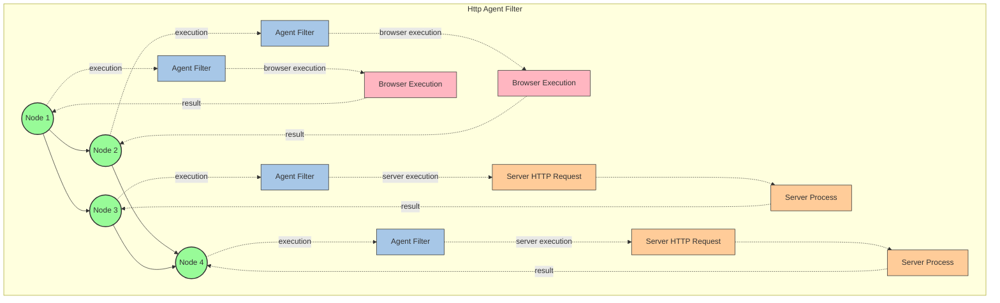

# @graphai/agent_filters for GraphAI

Agent filter collections for GraphAI.

## Install

```
yarn add @graphai/agent_filters
```

## Usage


### namedInput Validator

Validate values of namedInputs based on the input schema of agentFunctionInfo

https://github.com/isamu/graphai/blob/agentFilter/packages/agent_filters/tests/validation/test_agent_namedinput_validator.ts

```typescript
import { GraphAI } from "graphai";
import * as agents from "@graphai/agents";
import { namedInputValidatorFilter } from "@graphai/agent_filters";

const agentFilters = [
  {
    name: "namedInputValidatorFilter",
    agent: namedInputValidatorFilter,
  },
];

const graph = new GraphAI(graph_data, agents, { agentFilters });
const results = await graph.run();

```


### streamAgentFilterGenerator

Receive stream data externally through streamTokenCallback of filterParams.
Available for both server and client. See express code.

#### server

https://github.com/receptron/graphai_utils/blob/main/packages/express/src/express.ts

express server
```typescript
    return async (req: express.Request, res: express.Response) => {
      res.setHeader("Content-Type", "text/event-stream;charset=utf-8");
      res.setHeader("Cache-Control", "no-cache, no-transform");
      res.setHeader("X-Accel-Buffering", "no");

      const callback = (context: AgentFunctionContext, token: string) => {
        if (token) {
          res.write(token);
        }
      };
      const streamAgentFilter = {
        name: "streamAgentFilter",
        agent: streamAgentFilterGenerator<string>(callback),
      };
      const agentFilters = [streamAgentFilter]

      const agentFilterRunner = agentFilterRunnerBuilder(agentFilters);
      const result = await agentFilterRunner(context, agent.agent);

      const json_data = JSON.stringify(result);
      res.write("___END___");
      res.write(json_data);
      return res.end();
   }
```

### web client

https://github.com/isamu/graphai-stream-web/blob/main/src/views/Home.vue

```typescript
const useAgentFilter = (callback: (context: AgentFunctionContext, data: T) => void) => {
  const streamAgentFilter = streamAgentFilterGenerator(callback);

  const agentFilters = [
    {
      name: "streamAgentFilter",
      agent: streamAgentFilter,
      agentIds: streamAgents,
    },
  ];
  return agentFilters;
};   

export default defineComponent({
  setup() {
    const streamingData = ref<Record<string, unknown>>({});

    const callback = (context: AgentFunctionContext, data: string) => {
      const { nodeId } = context.debugInfo;
      streamingData.value[nodeId] = (streamingData.value[nodeId] ?? "") + data;
    };
    const agentFilters = useAgentFilter(callback);
    
    const graphai = new GraphAI(graphData, agents, { agentFilters });
  }
})
```

### httpAgentFilter

In graph flow, bypass the agent execution and run it on the server via http.

Refer to the web sample.

https://github.com/isamu/graphai-stream-web/blob/main/src/views/Home.vue





### agentFilterRunnerBuilder

Execute agent filter and agent in test for agent filter usage
It also run agent filter and agent outside of GraphAI. This is useful in Express web server.


see express sample and test code.

express
https://github.com/receptron/graphai_utils/blob/main/packages/express/src/express.ts

test
https://github.com/isamu/graphai/blob/agentFilter/packages/agent_filters/tests/filters/test_filter_runner.ts


### ConsoleStepRunner

To debug graph data in the console, you can execute each agent step by step.

You need to install the @inquirer/input npm package.

It can be used via:

```

import { consoleStepRunner } from "@graphai/agent_filters";

const agentFilters = [
  {
    name: "consoleStepRunner",
    agent: consoleStepRunner,
  },
];

const graph = new GraphAI(
  graph_data,
  {
    ...agents,
  },
  { agentFilters },
);
await graph.run();
```


