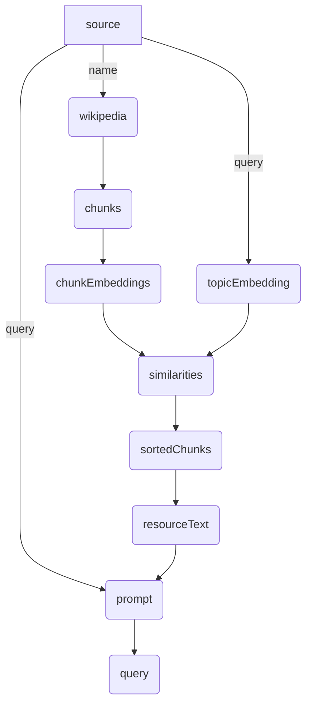
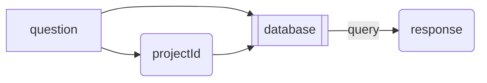
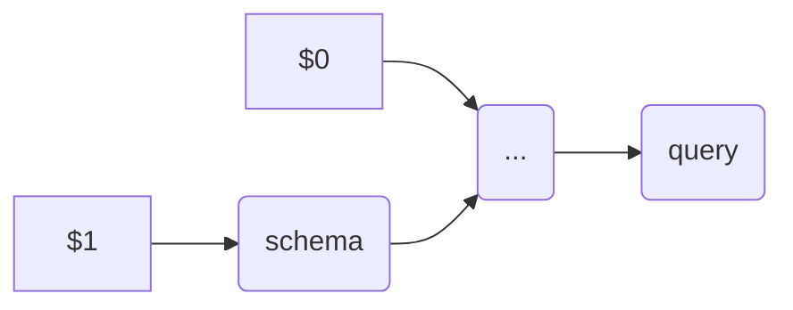
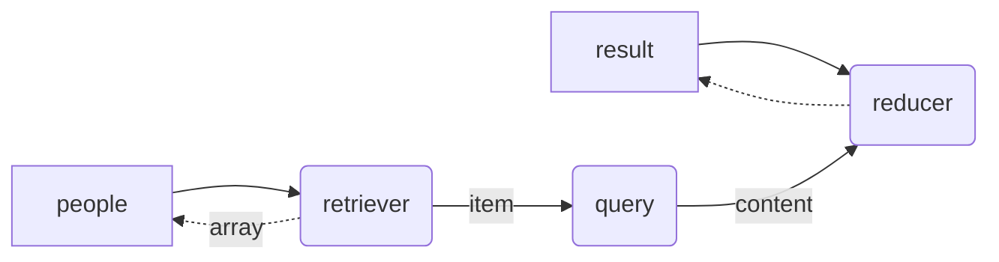
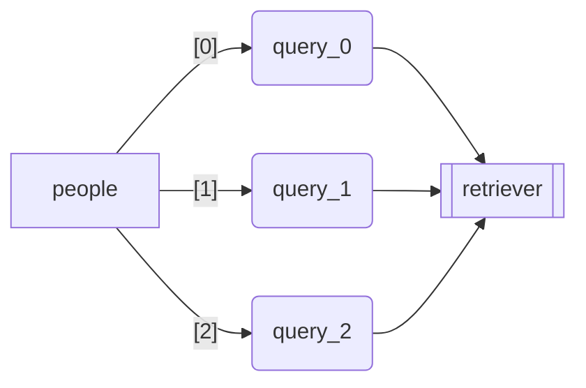

# GraphAI

## Overview

GraphAI is an asynchronous data flow execution engine, which allows developers to build *agentic applications* by describing *agent workflows* as declarative data flow graphs in YAML or JSON. 

As Andrew Ng has described in his article, "[The batch: Issue 242](https://www.deeplearning.ai/the-batch/issue-242/)", better results can often be achieved by making multiple calls to a Large Language Model (LLM) and allowing it to incrementally build towards a higher-quality output. Dr. Ng refers to this approach as 'agentic workflows.' 

Such *agentic applications* require making multiple asynchronous API calls (e.g., OpenAI's chat-completion API, database queries, web searches) and managing data dependencies among them. As the complexity of the application increases, managing these dependencies in a traditional programming style becomes challenging due to the asynchronous nature of the APIs.

GraphAI allows developers to describe dependencies among those agents (asynchronous API calls) in a data flow graph in YAML or JSON, which is called *declarative data flow programming* . The GraphAI engine will take care of all the complexity of concurrent asynchronous calls, data dependency management, task priority management, map-reduce processing, error handling, retries and logging. 

## Declarative Data Flow Programming

Here is a simple example, which uses the Wikipedia as the data source and perform an in-memory RAG (Retrieval-Augmented Generation).

```YAML
version: 0.5
nodes:
  source:
    value:
      name: Sam Bankman-Fried
      topic: sentence by the court
      query: describe the final sentence by the court for Sam Bank-Fried
  wikipedia:
    console:
      before: ...fetching data from wikkpedia
    agent: wikipediaAgent
    inputs:
      query: :source.name
    params:
      lang: en
  chunks:
    console:
      before: ...splitting the article into chunks
    agent: stringSplitterAgent
    inputs:
      text: :wikipedia.content
  chunkEmbeddings:
    console:
      before: ...fetching embeddings for chunks
    agent: stringEmbeddingsAgent
    inputs:
      array: :chunks.contents
  topicEmbedding:
    console:
      before: ...fetching embedding for the topic
    agent: stringEmbeddingsAgent
    inputs:
      item: :source.topic
  similarities:
    agent: dotProductAgent
    inputs:
      matrix: :chunkEmbeddings
      vector: :topicEmbedding.$0
  sortedChunks:
    agent: sortByValuesAgent
    inputs:
      array: :chunks.contents
      values: :similarities
  referenceText:
    agent: tokenBoundStringsAgent
    inputs:
      chunks: :sortedChunks
    params:
      limit: 5000
  prompt:
    agent: stringTemplateAgent
    inputs:
      prompt: :source.query
      text: :referenceText.content
    params:
      template: |-
        Using the following document, ${text}

        ${prompt}
  RagQuery:
    console:
      before: ...performing the RAG query
    agent: openAIAgent
    inputs:
      prompt: :prompt
    params:
      model: gpt-4o
  OneShotQuery:
    agent: openAIAgent
    inputs:
      prompt: :source.query
    params:
      model: gpt-4o
  RagResult:
    agent: copyAgent
    inputs:
      result: :RagQuery.text
    isResult: true
  OneShotResult:
    agent: copyAgent
    inputs:
      result: :OneShotQuery.text
    isResult: true

```



Notice that the conversion of the query text into an embedding vector and text chunks into an array of embedding vectors can be done concurrently because there is no dependency between them. GraphAI will automatically recognize it and execute them concurrently. This kind of *concurrent programing* is very difficult in traditional programming style, and GraphAI's *data flow programming* style is much better alternative.

## Quick Install

```
npm install graphai
```

or

```
yarn add graphai
```

## Data Flow Graph

A Data Flow Graph (DFG) is a JavaScript object, which defines the flow of data. It is typically described in YAML file and loaded at runtime.

A DFG consists of a collection of [nodes](#node), which contains a series of nested properties representing individual nodes in the data flow. Each node is identified by a unique key, *nodeId* (e.g., node1, node2) and can contain several predefined properties (such as params, inputs, and value) that dictate the node's behavior and its relationship with other nodes. There are two types of nodes, [computed nodes](#computed-node) and [static nodes](#static-node), which are described below.

### Data Source

Connections between nodes will be established by references from one node to another, using either its "inputs", "update", "if" or "while" property. The values of those properties are *data sources*. A *data souce* is specified by either the ":" + nodeId (e.g., ":node1"), or ":" + nodeId + propertyId (e.g., ":node1.item"), index (e.g., ":node1.$0", ":node2.$last") or combinations (e.g., ":node1.messages.$0.content").

### DFG Structure

- *version*: GraphAI version, *required*. The latest version is 0.3.
- *nodes*: A list of node. Required.
- *concurrency*: An optional property, which specifies the maximum number of concurrent operations (agent functions to be executed at the same time). The default is 8.
- *loop*: An optional property, which specifies if the graph needs to be executed multiple times (iterations). See the [Loop section below](#loop) for details.

## Agent

An *agent* is an abstract object which takes some inputs and generates an output asynchronously. It could be an LLM call (such as GPT-4), a media generator, a database access, or a REST API over HTTP. A node associated with an agent (specified by the *agent*'* property) is called [computed node](#computed-node), which takes a set of *inputs* from *data sources*, asks the *agent function* to process it, and makes the returned value available to other nodes.

### Agent function

An *agent function* is a TypeScript function, which implements a particular *agent*, performing some computations for the associated *computed node*. An *agent function* receives a *context* (type AgentFunctionContext), which has following properties:

- *params*: agent specific parameters specified in the DFG (specified by the "params" property of the node)
- *inputs*: a set of inputs came from other nodes (specified by "inputs" property of the node).
- *debugInfo*: a set of information for debugging purposes.

There are additional optional parameters for developers of nested agents and agent filters.

- *graphData*: an optional GraphData (for nested agents)
- *agents*: AgentFunctionInfoDictionary (for nested agents)
- *taskManager*: TaskManager (for nested agents)
- *log*: TransactionLog[] (for nested agents)
- *filterParams*: agent filter parameters (for agent filters)

### Inline Agent Function

An *inline agent function* is a simplified version of *agent function*, which is embedded in the graph (available only when the graph was described in TypeScript). An *inline agent function* receives only the *inputs* paramter as a variable length arguments.

Here is an examnple (from [weather chat](https://github.com/receptron/graphai/blob/main/samples/sample_weather.ts)):

```typescript
    messagesWithUserInput: {
      // Appends the user's input to the messages.
      agent: ({ messages: Array<any>, content: string }) => [...messages, { role: "user", content }],
      inputs:
        messages: ":messages"
        content: ":userInput"
      if: "checkInput",
    },
```

## Node

There are two types of Node, *computed nodes* and *static nodes*. 

A *computed node* is associated with an *agent function*, which receives some inputs, performs some computations asynchronously, and returns the result (output). 

A *static node* is a placeholder of a value (just like a variable in programming languages), which is initially specified by its *value* property, and can be updated by an external program (before the execution of the graph), or updated using the *update* property at the end of each iteration of a [loop](#loop) operation. 

### Computed Node

A *computed node* has following properties.

- *agent*: An **required** property, which specifies the id of the *agent function*, or an *inline agent function* (NOTE: this is not possible in JSON or YAML).
- *params*: An optional agent-specific property to control the behavior of the associated agent function. The top level property may reference a *data source*.
- *inputs*: An optional list of *data sources* that the current node receives the data from. This establishes a data flow where the current node can only be executed after the completion of the nodes listed under *inputs*. If this list is empty, the associated *agent function* will be immediatley executed. 
- *anyInput*: An optiona boolean flag, which indicates that the associated *agent function* will be called when at least one of input data became available. Otherwise, it will wait until all the data became available.
- *retry*: An optional number, which specifies the maximum number of retries to be made. If the last attempt fails, the error will be recorded.
- *timeout*: An optional number, which specifies the maximum waittime in msec. If the associated agent function does not return the value in time, the "Timeout" error will be recorded. The returned value received after the time out will be discarded.
- *isResult*: An optional boolean value, which indicates that the return value of this node, should be included as a property of the return value from the run() method of the GraphUI instance.
- *priority*: An optional number, which specifies the priority of the execution of the associated agent (the task). Default is 0, which means "neutral". Negative numbers are allowed as well.
- *if*: An optional data source property. The node will be activated only if the value from the data source is truthy. 
- *unless*: An optional data source property. The node will be activated only if the value from the data source is falty (including empty array). 
- *graph*: An optional property for nested agents, which specifies the inner graph. This value can be a graph itself or the data souce, whose value is a graph.

### Static Node

A *static* node has following properties.

- *value*: An **required** property, which specifies the initial value of this static node (equivalent to calling the injectValue method from outside).
- *update*: An optional property, which specifies the *data source* for a [loop](#loop) operation. After each iteration, the value of this node will be updated with the data from the specified *data source*.

## Flow Control

Since the data-flow graph must be asyclic by design, we added a few mechanisms to control data flows, [nesting](#nesting), [loop](#loop), [mapping](#mapping) and [conditional flow](#conditional-flow).

### Nested Graph

In order to make it easy to reuse some code, GraphAI supports nesting. It requires a special agent function, which creates an instance (or instances) of GraphAI object within the agent function and execute it. The system supports two types of nesting agent functions (nestAgent and mapAgent), but developers can create their own using the standard agent extension mechanism.

A typical nesting graph looks like this:

```YAML
nodes:
  question:
    value: "Find out which materials we need to purchase this week for Joe Smith's residential house project."
  projectId: // identifies the projectId from the question
    agent: identifierAgent
    inputs: 
      id: :source
  database:
    agent: "nestedAgent"
    inputs:
      prompt: ":question"
      projectId: ":projectId"
    graph:
      nodes:
        schema: // retrieves the database schema for the apecified projectId
          agent: "schemaAgent"
          inputs: [":projectId"]
        ... // issue query to the database and build an appropriate prompt with it.
        query: // send the generated prompt to the LLM
          agent: "llama3Agent"
          inputs:
            promot: ":prompt"
          isResult: true
  response: // Deliver the answer
    agent: "deliveryAgent"      
    inputs:
      text: :database.query.$last.content
```

The databaseQuery node (which is associated "nestedAgent") takes the data from "question" node abd "projectId" node, and make them available to inner nodes (nodes of the child graph) via phantom node, "$0" and "$1". After the completion of the child graph, the data from "query" node (which has "isResult" property) becomes available as a property of the output of "database" node.

Here is the diagram of the parent graph.



Here is the diagram of the child graph. Notice that two phantom nodes are automatically created to allow inner nodes to access input data from the parent graph.



This mechanism does not only allows devleoper to reuse code, but also makes it possible to execute the child graph on another machine using a "remote" agent (which will be released later), enabling the *distributed execution* of nested graphs. 

### Loop

The loop is an optional property of a graph, which has two optional properties. 

- *count*: Specifies the number of times the graph needs to be executed.
- *while*: Specifies the *data source* to check after the each iteration. It continues if the data from that *data source* is *true*. Unlike JavaScript, an empty array will be treated as *false*.

Here is an example, which performs an LLM query for each person in the list and create the list of answers. The "people" node (static), is initialized with an array of names, and the "retriever" node (computed) retrieves one name at a time, and sends it to the "query" node (computed) to perform an LLM query. The "reducer" append it the array retrieved form the "result" node (static node, which is initialized as an empty array). 

The "update" property of two static nodes ("people" and "result"), updates those properties based on the results from the previous itelation. This loop continues until the value of "people" node become an empty array.

```
loop:
  while: :people
nodes:
  people:
    value: [Steve Jobs, Elon Musk, Nikola Tesla]
    update: :retriever.array
  result:
    value: []
    update: :reducer
    isResult: true
  retriever:
    agent: shift
    inputs:
      array: :people
  query:
    agent: slashgpt
    params:
      manifest:
        prompt: Describe about the person in less than 100 words
    inputs: [:retriever.item]
  reducer:
    agent: push
    inputs:
      array: :result
      item: :query.content
```



The *loop* mechanism is often used with a nested graph, which receives an array of data from a node of the parent graph and performs the "reduction" process of a *map-reduce* operation, just like the *reduce* method of JavaScript.

Please notice that each iteration will be done sequencially unlike the *mapping* described below.

### Mapping

The mapAgent is one of nested agents, which receives an array of data as an input (inputs[0]) and performs the same operation (specified by its graph property) on each item concurrently.

If the size of array is N, the mapAgent creates N instances of GraphAI object, and run them concurrently.

After the completion of all of instances, the mapAgent returns an array of results, just like the map function of JavaScript. 

The following graph will generate the same result (an array of answers) as the sample graph for the *loop*, but three queries will be issued concurretly. 

```
nodes:
  people:
    value: [Steve Jobs, Elon Musk, Nikola Tesla]
  retriever:
    agent: "mapAgent"
    inputs: { rows: ":people" }
    graph:
      nodes:
        query:
          agent: slashgpt
          params:
            manifest:
              prompt: Describe about the person in less than 100 words
          inputs: [":row"]
```

Here is the conceptual representation of this operation.


### Conditional Flow

GraphAI provides mechanisms to control the flow of data based on certain conditions. This is achieved through the *if* and *anyInput* properties.

#### If/Unless Property

The *if* property allows you to specify a condition that must be met for the data to flow into a particular node. The condition is defined by a data source. If the value obtained from the specified *data source* is truthy (i.e., not null, undefined, 0, false, NaN, or an empty array/string), the node will be executed; otherwise, it will be skipped.The *unless* property is just the opporsite of the *if* property. 

For example, the following node will be executed only if the *tool_calls* property of the message from the LLM contains a non-zero/non-empty value:

```typescript
    tool_calls: {
      // This node is activated if the LLM requests a tool call.
      agent: "nestedAgent",
      inputs: [":groq.choices.$0.message.tool_calls", ":messagesWithFirstRes"],
      if: ":groq.choices.$0.message.tool_calls",
      graph: {
        // This graph is nested only for the readability.
```

It is recommended to use the *if* property in conjunction with nested graphs for better code readability and organization.

#### AnyInput Property

The *anyInput* property (boolean) allows you to merge multiple data flow paths into a single node. When set to *true*, the agent function associated with the node will be executed as soon as data becomes available from any of the specified input data sources.

This property is particularly useful when you want to continue the flow regardless of which path the data comes from. In the weather chat sample application, it is used to continue the chat iteration whether a tool was requested by the LLM or not:

```typescript
    reducer: {
      // Receives messages from either case.
      agent: "copyAgent",
      anyInput: true,
      inputs: 
        array: [":no_tool_calls", ":tool_calls.messagesWithSecondRes"],
    },
```

In this example, the "reducer" node will execute as soon as data is available from either the "no_tool_calls" or "tool_calls.messagesWithSecondRes" data source.

By combining the *if* and *anyInput* properties, you can create complex conditional flows that control the execution of nodes based on the availability and values of data from various sources. This flexibility allows you to build sophisticated data-driven applications with GraphAI.

## Concurrency

GraphAI supports concurrent execution of tasks, allowing you to leverage parallelism and improve performance. The level of concurrency can be controlled through the *concurrency* property at the top level of the graph definition.

```typescript
  concurrency: 16 # Maximum number of concurrent tasks
```

If the *concurrency* property is not specified, the default value of 8 is used.

### Concurrency and Nested Graphs

Since the task queue is shared between the parent graph and the children graph (uness the graph is running remotely), tasks created by the child graph will be bound by the same concurrency specified by the parent graph. 

Since the task executing the nested graph will be in "running" state while tasks within the child graph are runnig, the concurrency limit will be incremented by one when we start running the child graph and restored when it is completed.

### Task Prioritization

By default, tasks are executed in a first-in, first-out (FIFO) order with a neutral priority (0). However, you can assign custom priorities to nodes using the *priority* property. Tasks associated with nodes that have a higher priority value will be executed before those with lower priorities.

Negative priority values are allowed, enabling you to fine-tune the execution order based on your application's requirements.