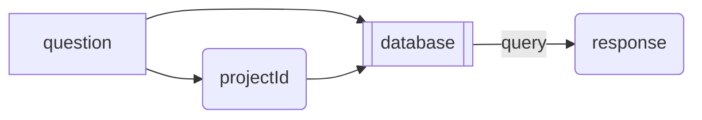
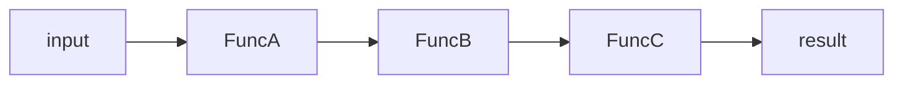
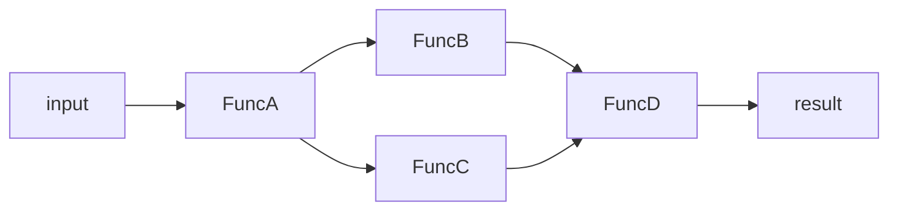
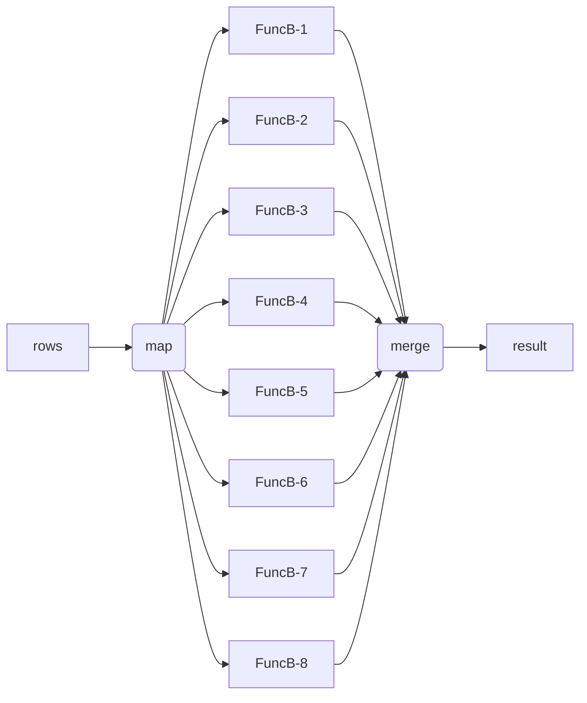

```mermaid
flowchart LR
 question --> projectId(projectId)
 question --> database
 projectId --> database
 database[[database]] -- query --> response(response)
```

```mermaid
flowchart LR
 input --> FuncA
 FuncA --> FuncB
 FuncB --> FuncC
 FuncC --> result
```

```mermaid
flowchart LR
 input --> FuncA
 FuncA --> FuncB
 FuncA --> FuncC
 FuncB --> FuncD
 FuncC --> FuncD
 FuncD --> result
```

```mermaid
flowchart LR
 rows --> FuncA(map)
 FuncA --> FuncB-1
 FuncA --> FuncB-2
 FuncA --> FuncB-3
 FuncA --> FuncB-4
 FuncA --> FuncB-5
 FuncA --> FuncB-6
 FuncA --> FuncB-7
 FuncA --> FuncB-8
 FuncB-1 --> FuncD(merge)
 FuncB-2 --> FuncD
 FuncB-3 --> FuncD
 FuncB-4 --> FuncD
 FuncB-5 --> FuncD
 FuncB-6 --> FuncD
 FuncB-7 --> FuncD
 FuncB-8 --> FuncD
 FuncD --> result
```