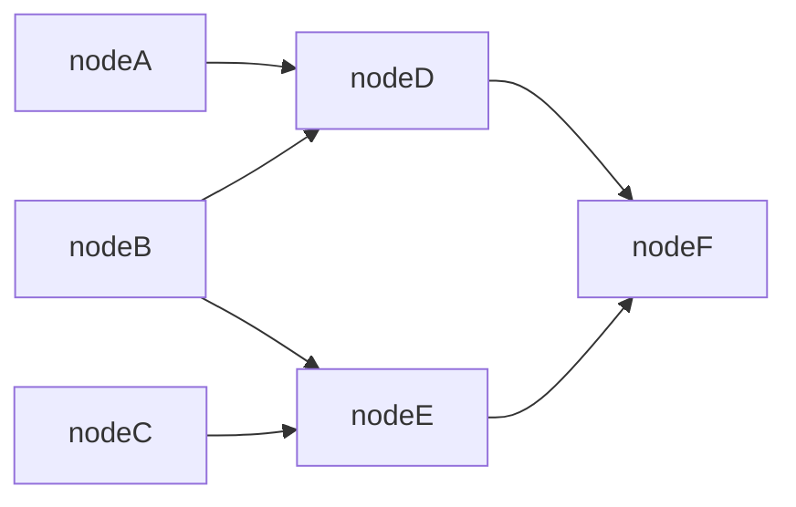

# GraphAI Lite

GraphAI Lite is a light-weight version of [GraphAI](https://github.com/receptron/graphai#readme), the declarative data-flow programming framework that makes it easy to develop complex applications utilizing multiple asynchronous calls and their concurrent executions.

GraphAI Lite consists of a set of small TypeScript libraries, allowing developers to leverage data-flow programming and eliminate the need to manage complex states involving asynchronous calls and concurrent executions.

## Usage

While async/await has simplified calling asynchronous functions, everything is executed sequentially, even when the tasks are independent.

```Typescript
const ExecuteAtoF = async () => {
  const a = await FuncA();
  const b = await FuncB();
  const c = await FuncC();
  const d = await FuncD(a, b);
  const e = await FuncE(b, c);
  return FuncF(d, e);
};
```

To execute independent asynchronous tasks concurrently, you need to use Promise.all. However, fully optimizing this can lead to hard-to-maintain code.

For example, the code below is slightly optimized but not fully optimized (FuncD needs to wait until FuncC is done even though there is no dependency, and FuncE needs to wait for FuncA).

```Typescript
const ExecuteAtoF = async () => {
  const [a, b, c] = await Promise.all([FuncA(), FuncB(), FuncC()]);
  const [d, e] = await Promise.all([FuncD(a, b), FuncE(b, c)]);
  return FuncF(d, e);
};
```

The ```computed``` function of GraphAI Lite is a thin wrapper around Promise.all, enabling data-flow style programming. You just need to specify the dependencies of various tasks (nodes) and let the system figure out the appropriate execution order.

```Typescript
import { computed } from '@receptron/graphai_lite';

const ExecuteAtoF = async () => {
  const nodeA = FuncA();
  const nodeB = FuncB();
  const nodeC = FuncC();
  const nodeD = computed([nodeA, nodeB], FuncD);
  const nodeE = computed([nodeB, nodeC], FuncE);
  const nodeF = computed([nodeD, nodeE], FuncF);
  return nodeF;
};
```

Below is the data-flow diagram represented by the code above (the graph is visible only on [Github](https://github.com/receptron/graphai/tree/main/packages/lite#readme)).



## Logger

The ```computed``` class of GraphAI Lite allows developers to log the executions of those asynchronous tasks.

```Typescript
import { computed, Logger } from '@receptron/graphai_lite';

const ExecuteAtoF = async (logger: Logger) => {
  const nodeA = logger.computed([], FuncA, { name: "nodeA" });
  const nodeB = logger.computed([], FuncB, { name: "nodeB" });
  const nodeC = logger.computed([], FuncC, { name: "nodeC" });
  const nodeD = logger.computed([nodeA, nodeB], FuncD, { name: "nodeD" });
  const nodeE = logger.computed([nodeB, nodeC], FuncE, { name: "nodeE" });
  const nodeF = logger.computed([nodeD, nodeE], FuncF, { name: "nodeF" });
  logger.result = {
    f: await nodeF
  };
};

const logger = new Logger({ verbose:true });
await ExecuteAtoF(logger);
console.log(logger.logs);
console.log(logger.result);
```