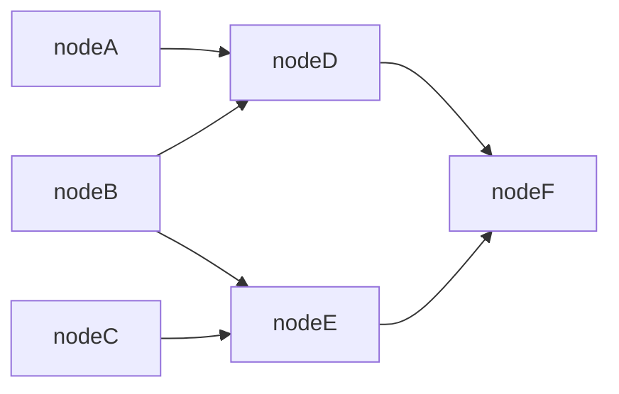

# GraphAI Lite

GraphAI Lite is a light-weight version of GraphAI, the declarative data-flow programming framework, which makes it easy to develop complex applications that utilize multiple asynchronous calls and concurrent executions of them.

GraphAI Lite consists of a set of small TypeScript libraries, which allows devleopers to take advantage of data-flow programming, eliminating the need to manage complex states involving asynchronous calls and cuncurrent executions. 

## Usage

While async/await made it simple to call asynchronous functions, everything will be executed sequentially even though they are independent.

```Typescript
const ExecuteAtoF = async () => {
  const a = await FuncA();
  const b = await FuncB();
  const c = await FuncC();
  const d = await FuncD(a, b);
  const e = await FuncE(b, c);
  return FuncF(d, e);
};
```

In order to execute independent tasks concurrently, you need to use Promise.all, but it's hard to fully optimize it and it often leads to hard-to-maintain code. 

For example, the code below is slightly optimized, but this is not fully optimized (FuncD needs to wait until FuncC is done even thought there is no dependencies, so as FundE needs to wait FuncA).

```Typescript
const ExecuteAtoF = async () => {
  const [a, b, c] = await Promise.all([FuncA(), FuncB(), FuncC()]);
  const [d, e] = await Promise.all([FuncD(a, b), FuncE(b, c)]);
  return FuncF(d, e);
};
```

The ```computed``` of GraphAI Lite is a lightweight function, which allows data-flow style programming. You just need to specify dependencies of various tasks (nodes), and let the system figure out the appropriate execution orders.

```Typescript
import { computed } from '@receptron/graphai_lite';

// FuncA/B/C/D/E/F are all async functions
const ExecuteAtoF = async () => {
  const nodeA = FuncA();
  const nodeB = FuncB();
  const nodeC = FuncC();
  const nodeD = computed([nodeA, nodeB], FuncD);
  const nodeE = computed([nodeB, nodeC], FuncE);
  const nodeF = computed([nodeD, nodeE], FuncF);
  return nodeF;
};
```

Below is the data-flow diagram, the code above represents.

